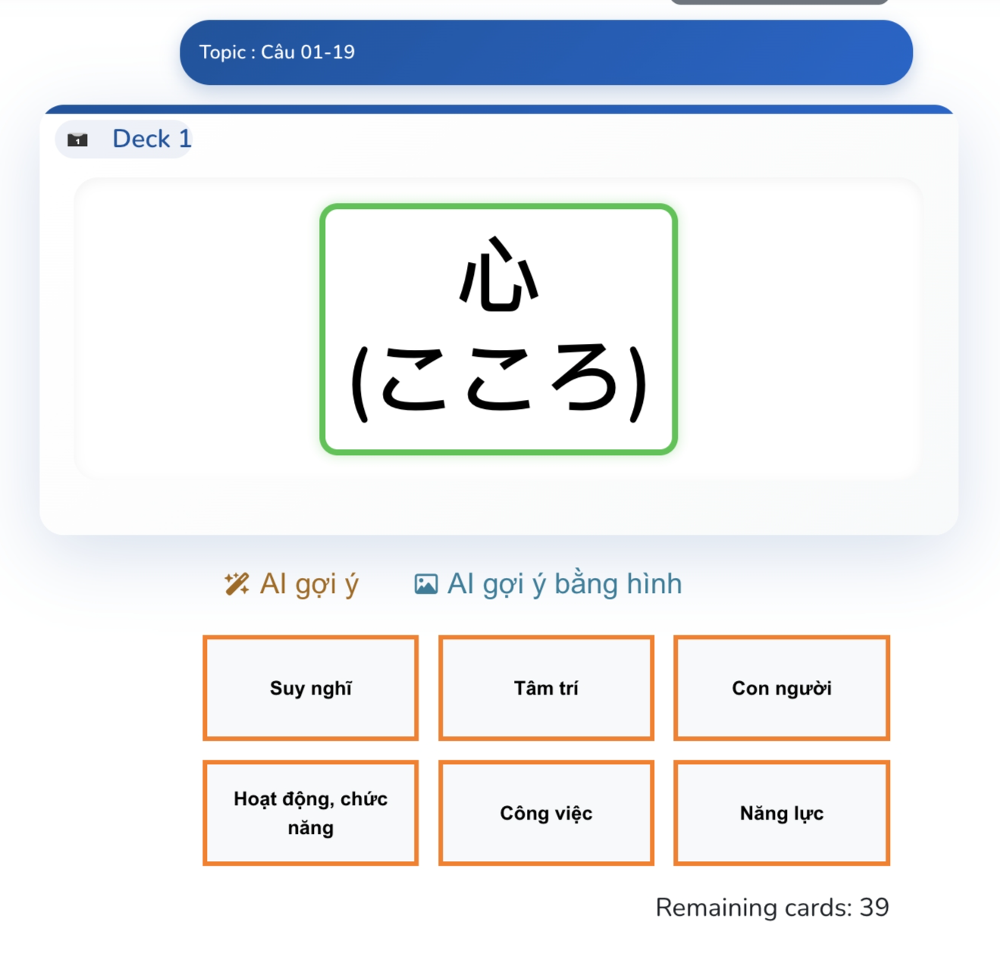
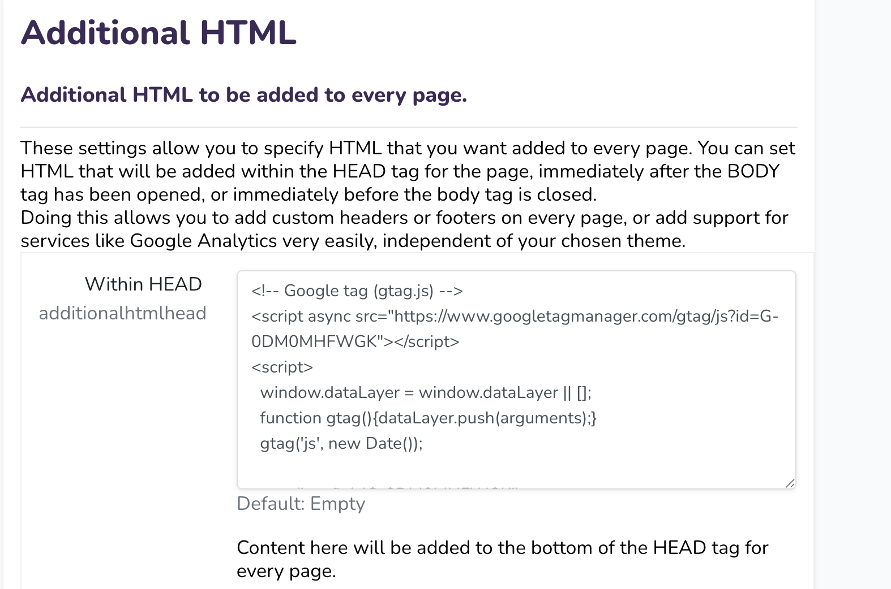
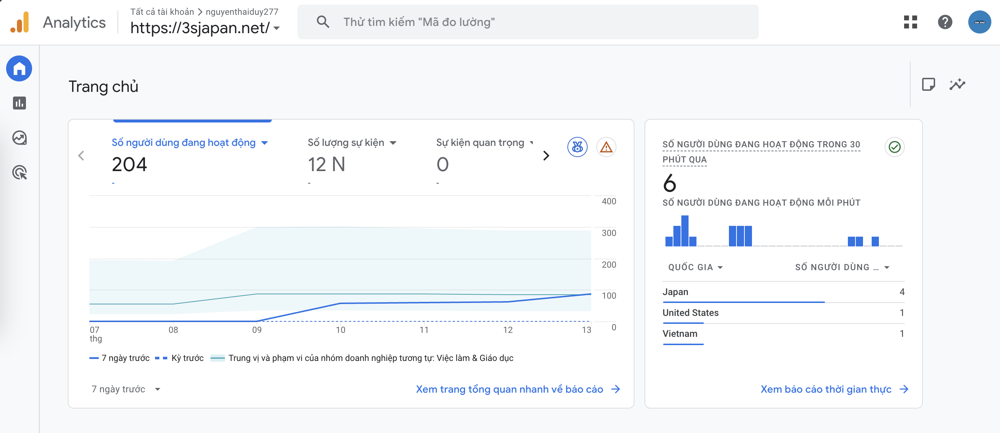
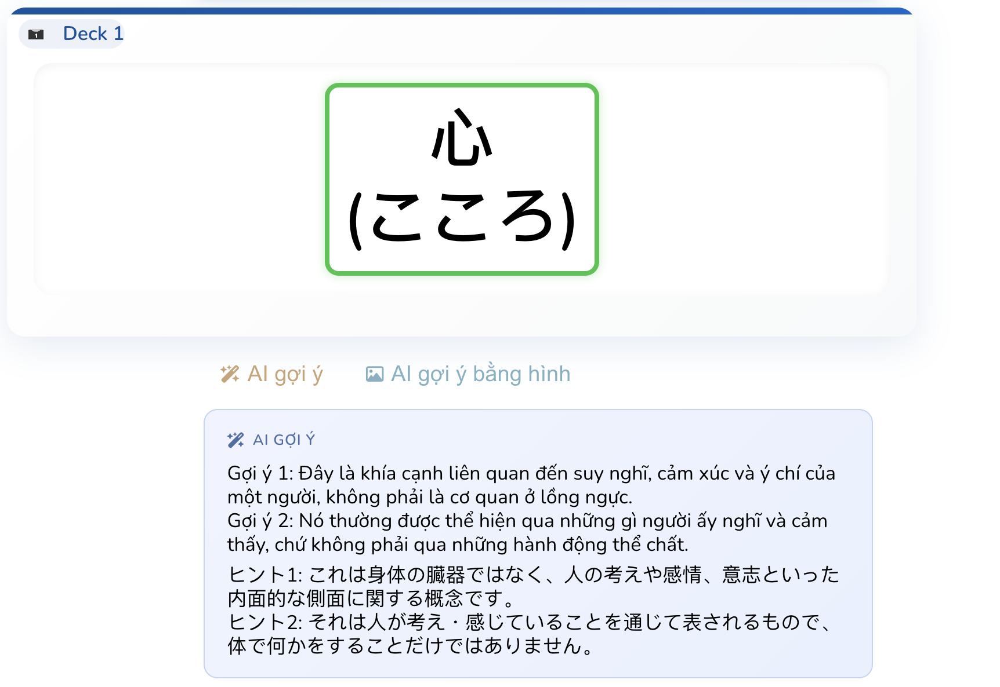
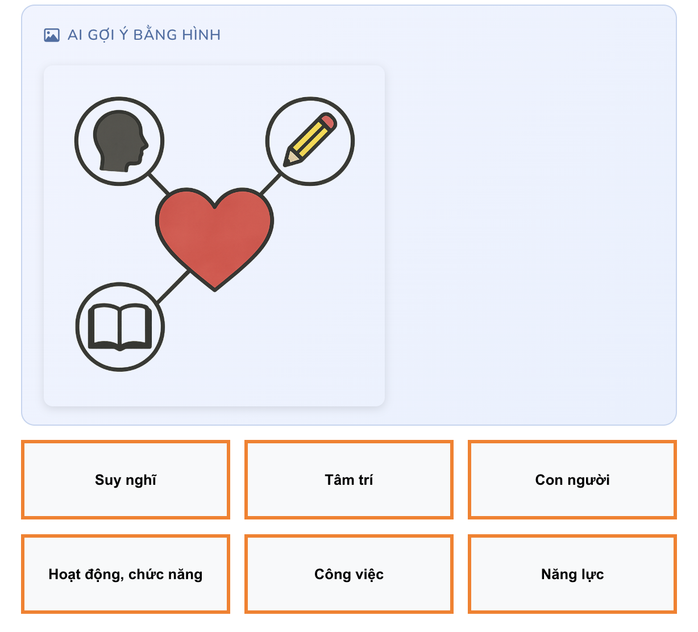
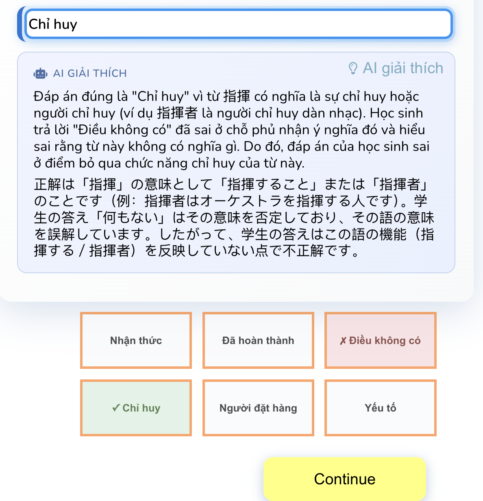

<!-- _class: title -->

  

  
TÍCH HỢP GOOGLE ANALYTICS VÀ AI

  
VÀO HỖ TRỢ GIẢNG DẠY TIẾNG NHẬT TRÊN NỀN TẢNG MOODLE

  

  

    
Giảng viên hướng dẫn:

    
PGS.TS. Nguyễn Thái Nghe

  

  

    
Thành viên thực hiện:

    
Nguyễn Thái Duy (M2525017)

    
Đỗ Thị Cẩm Hằng (M2525021)

  

  
CT573HT - Tiếp thị và kinh doanh kỹ thuật số

  
College of ICT, Can Tho University

---

## Mục lục

1. Đặt vấn đề
2. Nền tảng: Moodle & Plugin Cardbox
3. Kiến trúc hệ thống tích hợp
4. Tích hợp Google Analytics 4 (GA4)
5. Tích hợp AI — (1) AI Hint: Gợi ý câu hỏi
6. Tích hợp AI — (2) AI Explain: Giải thích câu trả lời sai
7. Tích hợp AI — (3) AI Course Suggest: Gợi ý khóa học
8. Tích hợp AI — (4) AI Card Generator: Tạo thẻ tự động
9. Đánh giá: AI trong thương mại điện tử giáo dục
10. Kết luận & Hướng phát triển
11. Q&A

---

## Đặt vấn đề

**Học flashcard — nhưng vẫn thiếu điều gì đó**

- Gặp thẻ khó → không có gợi ý, không biết hỏi ai → bỏ cuộc
- Lật thẻ xong → không hiểu *tại sao* đáp án lại như vậy
- Học một mình → không có phản hồi, không có động lực tiếp tục
- Bộ thẻ lớn → giảng viên mất hàng giờ nhập tay từng thẻ một

**Và từ góc nhìn giảng viên:**

- Không biết nội dung nào giúp ích, nội dung nào nên bỏ
- Không có dữ liệu để cải thiện khóa học

**→ Flashcard hiệu quả — nhưng chưa đủ thú vị, chưa đủ thông minh**

---

## Nền tảng: Moodle & Flashcard

<table style="width:100%; border-collapse:separate; border-spacing:10px; font-size:0.8em; margin-top:8px">
<tr>
  <td style="vertical-align:top; width:55%; padding:0">
    <strong>Moodle LMS</strong> — hệ thống quản lý học tập mã nguồn mở, phổ biến trong giáo dục đại học 
    <strong>mod_cardbox</strong> — plugin flashcard tích hợp sẵn trong Moodle  
    <strong>Tại sao chọn Flashcard?</strong>
    <table style="width:100%; font-size:0.95em; border-collapse:collapse">
    <tr><td style="padding:3px 6px"><strong>Spaced Repetition</strong></td><td style="padding:3px 6px">Ôn đúng lúc — tối ưu trí nhớ dài hạn</td></tr>
    <tr><td style="padding:3px 6px"><strong>Active Recall</strong></td><td style="padding:3px 6px">Buộc não nhớ lại thay vì đọc thụ động</td></tr>
    <tr><td style="padding:3px 6px"><strong>Microlearning</strong></td><td style="padding:3px 6px">10–15 phút/ngày đủ tiến bộ rõ rệt</td></tr>
    </table>
  </td>
  <td style="vertical-align:top; width:45%; padding:0">
    <table style="width:100%; border-collapse:separate; border-spacing:6px; font-size:0.9em">
    <tr>
      <td style="background:#e8f0fe; border-radius:8px; border-left:4px solid #1a56db; padding:10px; text-align:center">
        
200%

        
ghi nhớ tốt hơn

      </td>
      <td style="background:#e6f4ea; border-radius:8px; border-left:4px solid #137333; padding:10px; text-align:center">
        
50%

        
ít thời gian hơn

      </td>
      <td style="background:#fce8e6; border-radius:8px; border-left:4px solid #c5221f; padding:10px; text-align:center">
        
80%

        
nhớ sau 1 tuần

      </td>
    </tr>
    </table>
  </td>
</tr>
</table>

> Flashcard là phương pháp học ngoại ngữ được chứng minh hiệu quả — đặc biệt phù hợp với tiếng Nhật (Kanji, từ vựng, ngữ pháp). *(Cepeda 2008, Nation 2001, Roediger & Karpicke 2006)*

---

<!-- _class: image-slide -->

## Giao diện Plugin Cardbox

  

---

<!-- _class: content-slide -->

## Kiến trúc hệ thống tích hợp

Hai lớp tích hợp **độc lập**, **không xâm phạm** vào core Moodle — **GA4** (đo lường) + **AI** (nâng cao trải nghiệm):

<table style="width:100%; border-collapse:separate; border-spacing:0; font-size:0.78em; margin-top:10px">
<tr>
  <td style="width:28%; background:#e8f0fe; border-radius:10px; border-top:4px solid #1a56db; padding:12px 14px; vertical-align:top">
    <strong style="color:#1a56db; font-size:1.05em">🖥 Browser</strong>  
    <code>practice.js</code> 
    └ render thẻ flashcard 
    └ nhận input người dùng  
    <code>ga4Track()</code> 
    └ gửi custom events
  </td>
  <td style="width:6%; text-align:center; vertical-align:middle; font-size:1.6em; color:#1a56db; padding:0 4px">
    ── AJAX ──▶
  </td>
  <td style="width:28%; background:#fce8e6; border-radius:10px; border-top:4px solid #c5221f; padding:12px 14px; vertical-align:top">
    <strong style="color:#c5221f; font-size:1.05em">⚙️ mod_cardbox</strong>  
    <code>action.php</code> 
    └ xử lý request 
    └ chấm bài, gọi AI  
    <code>mdl_cardbox_*</code> 
    └ lưu thẻ & thống kê
  </td>
  <td style="width:6%; text-align:center; vertical-align:middle; font-size:1.6em; color:#137333; padding:0 4px">──▶</td>
  <td style="width:32%; vertical-align:top">
    

      <strong style="color:#137333">🤖 core_ai (Moodle)</strong> 
      AI Hint · AI Explain · bất kỳ LLM nào
    

    

      <strong style="color:#e65100">🖼 OpenAI Images API</strong> 
      AI Image Hint (gợi ý bằng hình)
    

    

      <strong style="color:#d68910">📊 GA4 Server</strong> 
      ← gtag() từ Browser · phân tích hành vi
    

  </td>
</tr>
</table>

---

## Tích hợp Google Analytics 4 (GA4)

**Bạn đang vận hành một site Moodle — nhưng bạn không biết gì cả**
- Có bao nhiêu sinh viên thực sự luyện tập mỗi ngày?
- Họ bỏ cuộc ở bài nào? Chủ đề nào khiến họ stuck?
- Tỉ lệ hoàn thành thực tế là bao nhiêu?

→ *Moodle mặc định không ghi nhận hành vi học tập — GA4 lấp đầy khoảng trống đó.*

**GA4** — nền tảng phân tích thế hệ mới, **event-based**, privacy-first
- Nhúng `gtag.js` vào `HEAD` qua `Site Admin → Appearance → Additional HTML`
- Tự động track toàn Moodle: pageviews, sessions, users, traffic source
- Thêm custom events từ plugin để biết người học làm gì bên trong

---

<!-- _class: image-slide -->

## Cấu hình GA4 trong Moodle

  

---

## GA4 — Custom Events cho Cardbox

Đã triển khai trong `js/practice.js`:

| Sự kiện | GA4 Event Name | Parameters chính |
|:---|:---|:---|
| Bắt đầu phiên | `practice_session_started` | `cardbox_id`, `card_count`, `mode` |
| Trả lời thẻ | `card_answered` | `card_id`, `correct`, `mode` |
| Kết thúc phiên | `practice_session_ended` | `cards_practiced`, `duration_sec` |

Hàm `ga4Track(eventName, params)` đặt ở **module scope** trong `practice.js` — cả `startPractice()` và object `Coordinate` đều gọi được. Hàm tự bỏ qua nếu `gtag` chưa được nạp, đảm bảo an toàn khi site chưa cài GA4.

**Ba thời điểm gửi event:** khi người học bắt đầu phiên, mỗi lần trả lời thẻ (kèm `correct: true/false`), và khi kết thúc phiên (kèm `duration_sec`).

---

## GA4 — Insights từ dữ liệu học tập

Các chỉ số theo dõi trên GA4 Dashboard:

- **Engagement**: Số phiên học/ngày, thời gian trung bình mỗi phiên, tỷ lệ hoàn thành
- **Performance**: Tỷ lệ trả lời đúng theo chủ đề (Hiragana / Katakana / Kanji / Từ vựng)
- **Retention**: Người học quay lại luyện tập sau 1 ngày / 7 ngày / 30 ngày
- **Content**: Thẻ nào bị sai nhiều nhất → giảng viên cần xem xét lại nội dung

> **Giá trị tiếp thị**: GA4 cho phép tối ưu hoá trải nghiệm người học như tối ưu conversion — biết chính xác người học "rời bỏ" ở bước nào trong hành trình học tập.

---

<!-- _class: image-slide -->

## GA4 Events Report — Dashboard

  

---

## Tích hợp AI — (1) AI Hint: Gợi ý câu hỏi

**Vấn đề:** Người học gặp thẻ khó → không có gợi ý → chọn "Tôi không biết" → **nản → bỏ cuộc**

**Giải pháp:** Nút **"✨ AI gợi ý"** — gợi ý thông minh, **cá nhân hóa theo từng người học**

AI đọc lịch sử của **người dùng hiện tại** với **thẻ hiện tại** từ DB → chọn mức gợi ý phù hợp:

<table style="width:100%; border-collapse:separate; border-spacing:8px; font-size:0.8em; margin-top:6px">
<tr style="font-weight:700; text-align:center">
  <td style="background:#f0f0f0; border-radius:8px; padding:8px">Dữ liệu người học</td>
  <td style="background:#f0f0f0; border-radius:8px; padding:8px">→</td>
  <td style="background:#f0f0f0; border-radius:8px; padding:8px">Mức gợi ý</td>
  <td style="background:#f0f0f0; border-radius:8px; padding:8px">Kiểu prompt AI</td>
</tr>
<tr>
  <td style="background:#fce8e6; border-radius:8px; padding:8px; color:#c5221f">Hộp 1 · sai ≥ 5 lần</td>
  <td style="text-align:center">→</td>
  <td style="background:#fce8e6; border-radius:8px; padding:8px; font-weight:700; color:#c5221f">🔴 Mức 1 — Khó</td>
  <td style="color:#555; padding:8px">Gợi ý chi tiết, nhiều liên tưởng</td>
</tr>
<tr>
  <td style="background:#fff8e1; border-radius:8px; padding:8px; color:#b45309">Hộp 1 · sai 2–4 lần</td>
  <td style="text-align:center">→</td>
  <td style="background:#fff8e1; border-radius:8px; padding:8px; font-weight:700; color:#b45309">🟡 Mức 2 — Đang học</td>
  <td style="color:#555; padding:8px">Gợi ý nhẹ + liên tưởng trực quan</td>
</tr>
<tr>
  <td style="background:#e6f4ea; border-radius:8px; padding:8px; color:#137333">Hộp 3+ · từng đúng</td>
  <td style="text-align:center">→</td>
  <td style="background:#e6f4ea; border-radius:8px; padding:8px; font-weight:700; color:#137333">🟢 Mức 3 — Từng biết</td>
  <td style="color:#555; padding:8px">Gợi ý ngắn, kích hoạt lại ký ức</td>
</tr>
</table>

---

## AI Hint — Tác động marketing

Đo lường qua GA4 events trước/sau khi triển khai AI Hint:

| Chỉ số | Trước AI Hint | Sau AI Hint |
|:---|:---|:---|
| **Drop-off** khi gặp thẻ khó | Bỏ phiên, không trả lời | Dùng gợi ý → tiếp tục học |
| **Session Duration** | Ngắn — bỏ sớm | Tăng — AI giữ người học ở lại |
| **Engagement Rate** | Thấp ở thẻ Kanji N4 | Cải thiện — ít bỏ cuộc hơn |
| **card_answered (correct)** | Thấp hơn | Tăng — nhờ gợi ý đúng lúc |

> **Insight:** Số lần AI Hint được gọi = danh sách ưu tiên những thẻ cần cải thiện nội dung.

---

## AI Hint — Demo luồng hoạt động

**Luồng trong Flashcard mode:**

1. Câu hỏi: *"Từ nào có nghĩa là 'ăn'?"*
2. Không nhớ → nhấn **✨ AI gợi ý**
3. AI: *"Động từ đuôi -る, diễn tả hành động đưa thức ăn vào miệng."*
4. **Nhớ ra → nhập đáp án → trả lời đúng → cảm giác thành công**

**Kết nối GA4:** Số lần `ai_hint` được gọi trước `card_answered` cho biết chính xác thẻ nào đang làm người học bỏ cuộc → **ưu tiên cải thiện nội dung những thẻ đó trước**.

> **Insight marketing:** AI Hint = công cụ giữ chân người học (giảm drop-off) + dữ liệu ưu tiên cải thiện nội dung.

---

<!-- _class: image-slide -->

## AI Hint — Giao diện gợi ý văn bản & hình ảnh

  
  

---

## Tích hợp AI — (2) AI Explain: Giải thích câu trả lời sai

**Vấn đề:** Người học trả lời sai → chỉ thấy đáp án đúng → không hiểu *tại sao* → **frustration → bỏ học**

**Giải pháp:** Nút **" AI giải thích"** xuất hiện ngay sau khi chấm sai

- AI giải thích ngắn gọn *tại sao đáp án đúng là đúng* và *sai ở điểm nào*
- Phản hồi song ngữ **tiếng Việt + tiếng Nhật** — phù hợp người học trong nước

> Thay đổi cảm xúc: từ **"bị phạt"** → **"được hướng dẫn"**

---

## AI Explain — Tác động marketing

Người học hiểu lý do sai → nhớ lâu hơn → **quay lại học** → tăng Retention

| Chỉ số | Tác động |
|:---|:---|
| **Returning Users** | Người học thấy hệ thống có ích → quay lại lần sau |
| **Session Duration** | Dừng lại đọc giải thích → tăng thời gian mỗi phiên |
| **Repeat errors** | Thẻ từng sai + có AI Explain → tỷ lệ đúng lần sau cao hơn |

> **Insight GA4:** `ai_explain` calls sau `card_answered(correct=false)` → biết thẻ nào người học muốn hiểu sâu → ưu tiên cải thiện nội dung.

---

## AI Explain — Demo & Giao diện

<table style="width:100%; border-collapse:separate; border-spacing:12px; font-size:0.82em">
<tr>
  <td style="vertical-align:top; width:50%; padding:0">
    <strong>Luồng hoạt động:</strong>  
    1. Câu hỏi: <em>"食べる có nghĩa là gì?"</em> 
    2. Nhập <em>"uống"</em> → chấm <strong style="color:#c5221f">sai</strong> 
    3. Nhấn <strong>✨ AI giải thích</strong> 
    4. AI: <em>"食べる (taberu) = 'ăn'. 'Uống' là 飲む (nomu). 食べる dùng cho thức ăn rắn, 飲む dùng cho chất lỏng."</em>  
    <strong>Kết nối GA4:</strong> <code>ai_explain</code> sau <code>card_answered(correct=false)</code> → biết thẻ nào cần cải thiện
  </td>
  <td style="vertical-align:top; width:50%; padding:0">
    
  </td>
</tr>
</table>

---

## Tích hợp AI — (3) AI Course Suggest: Gợi ý khóa học

**Vấn đề:** Người học hoàn thành bài test → chỉ thấy biểu đồ đúng/sai → **không biết học gì tiếp theo**

**Giải pháp:** Nút **"✨ AI gợi ý khóa học"** xuất hiện ngay sau khi kết thúc phiên luyện tập

- AI phân tích kết quả phiên: tỷ lệ đúng/sai, danh sách câu sai cụ thể
- Đưa ra **đánh giá trình độ** + **gợi ý khóa học/tài nguyên** + **lộ trình ôn tập**
- Phản hồi bằng **tiếng Việt**, có bullet points rõ ràng

> Thay đổi trải nghiệm: từ **"xong bài — bỏ đi"** → **"xong bài — biết học gì tiếp"**

---

## AI Course Suggest — Demo luồng hoạt động

**Luồng sau khi kết thúc phiên luyện tập:**

1. Hoàn thành phiên: 8/15 đúng (53%), 7 câu sai
2. Biểu đồ doughnut hiển thị kết quả
3. Nhấn **✨ AI gợi ý khóa học**
4. AI phân tích:
   - *"Trình độ: Đang ở giai đoạn N5→N4. Cần củng cố từ vựng cơ bản."*
   - *"Gợi ý: Minna no Nihongo Bài 10-15, app Anki deck N4 Kanji"*
   - *"Lộ trình: Ôn lại bộ Kanji cơ bản 2 ngày/lần, 15 phút mỗi phiên"*

**Kết nối GA4:** `ai_course_suggest` event → biết bao nhiêu người học cần tư vấn → đo mức độ engagement sau gợi ý

---

## AI Course Suggest — Tác động marketing

| Chỉ số | Tác động |
|:---|:---|
| **Returning Users** | Người học có lộ trình rõ ràng → quay lại lần sau |
| **Engagement** | Nhận gợi ý cụ thể → tăng động lực tiếp tục |
| **Session quality** | Từ "luyện tập bị động" → "hành trình học có hướng dẫn" |
| **Retention** | Cá nhân hóa trải nghiệm → giảm tỷ lệ bỏ học |

> **Insight GA4:** Tỷ lệ click "AI gợi ý khóa học" sau phiên có % thấp → cần cải thiện nội dung thẻ.
> Tỷ lệ click cao + quay lại luyện tập → chứng minh giá trị của tính năng.

---

## Tích hợp AI — (4) AI Card Generator: Tạo thẻ tự động

**Vấn đề:** Giảng viên mất hàng giờ nhập tay từng thẻ → **bottleneck mở rộng nội dung**

**Giải pháp:** **AI tạo thẻ tự động** — 2 chế độ:

<table style="width:100%; border-collapse:separate; border-spacing:8px; font-size:0.82em; margin-top:6px">
<tr>
  <td style="background:#e8f0fe; border-radius:10px; border-left:5px solid #1a56db; padding:14px 16px; vertical-align:top; width:50%">
    <strong style="color:#1a56db">📝 Nhập từ/chủ đề</strong>  
    Nhập <em>"食べる"</em> hoặc <em>"màu sắc"</em> 
    → AI tạo cặp Q&A tiếng Nhật 
    → Lưu thẳng vào bộ thẻ
  </td>
  <td style="background:#e6f4ea; border-radius:10px; border-left:5px solid #137333; padding:14px 16px; vertical-align:top; width:50%">
    <strong style="color:#137333">🎌 Chọn cấp JLPT (N1–N5)</strong>  
    Chọn N5 → AI chọn từ ngẫu nhiên 
    → Tạo flashcard phù hợp cấp độ 
    → Mỗi lần nhấn = 1 thẻ mới
  </td>
</tr>
</table>

> **Giá trị:** Giảm **80% thời gian** biên soạn. Giảng viên tập trung duyệt nội dung thay vì nhập liệu.
> **GA4 insight:** Đo số thẻ AI-generated vs manual → biết AI đóng góp bao nhiêu % nội dung.

---

## Đánh giá: AI trong thương mại điện tử giáo dục

<table style="width:100%; border-collapse:separate; border-spacing:8px; font-size:0.78em; margin-top:6px">
<tr>
  <td style="background:#e8f0fe; border-radius:10px; border-left:5px solid #1a56db; padding:14px 16px; vertical-align:top; width:50%">
    <strong style="color:#1a56db">🎯 Cá nhân hóa hành trình mua</strong> 
    AI phân tích kết quả test → gợi ý khóa học phù hợp trình độ → <strong>tăng tỷ lệ chuyển đổi (conversion)</strong>, giống như Amazon "Khách hàng cũng mua..."
  </td>
  <td style="background:#e6f4ea; border-radius:10px; border-left:5px solid #137333; padding:14px 16px; vertical-align:top; width:50%">
    <strong style="color:#137333">📈 Tăng giá trị vòng đời (LTV)</strong> 
    Người học nhận lộ trình → mua khóa tiếp theo → <strong>upsell tự nhiên</strong>. AI biến 1 lần mua thành chuỗi khóa học liên tục
  </td>
</tr>
<tr>
  <td style="background:#fff3e0; border-radius:10px; border-left:5px solid #e65100; padding:14px 16px; vertical-align:top">
    <strong style="color:#e65100">🔄 Giảm tỷ lệ bỏ học (Churn)</strong> 
    AI Hint + AI Explain giữ người học không bỏ cuộc → <strong>giảm hoàn tiền</strong>, tăng đánh giá 5 sao → thu hút khách hàng mới
  </td>
  <td style="background:#fce8e6; border-radius:10px; border-left:5px solid #c5221f; padding:14px 16px; vertical-align:top">
    <strong style="color:#c5221f">💡 Nội dung tự động — giảm chi phí</strong> 
    AI Card Generator tạo thẻ tự động → <strong>giảm 80% thời gian</strong> biên soạn → mở rộng catalogue nhanh hơn đối thủ
  </td>
</tr>
</table>

> **Kết luận:** AI không chỉ cải thiện trải nghiệm học — mà trực tiếp **tăng doanh thu**: conversion cao hơn, retention tốt hơn, chi phí sản xuất nội dung thấp hơn.

---

## Hạn chế

- **GA4 & quyền riêng tư**: Cần tuân thủ GDPR/chính sách dữ liệu của trường; không thu thập dữ liệu nhận dạng cá nhân
- **AI Hint / AI Explain**: Chất lượng phụ thuộc vào AI provider được cấu hình trong Moodle; không dùng được nếu admin chưa cài plugin `aiprovider_openai` hoặc tương đương
- **AI Image**: Dùng trực tiếp OpenAI API key — chi phí phát sinh mỗi lần generate; cần quản lý quota
- **Latency**: Gọi AI API thêm 3-5 giây mỗi request — hiện chưa có cơ chế cache

---

## Kết luận

**Đã triển khai thành công:**

| Tính năng | Mục tiêu | Trạng thái |
|:---|:---|:---|
| **GA4 Integration** | Đo lường hành vi học tập (3 custom events) | ✅ Hoàn thành |
| **AI Hint** | Gợi ý cá nhân hóa (văn bản + hình ảnh) | ✅ Hoàn thành |
| **AI Explain** | Giải thích câu sai song ngữ Việt–Nhật | ✅ Hoàn thành |
| **AI Course Suggest** | Gợi ý khóa học + lộ trình sau test | ✅ Hoàn thành |
| **AI Card Generator** | Tạo thẻ tự động (từ/JLPT) | ✅ Hoàn thành |

**Giá trị mang lại:** GA4 cung cấp dữ liệu để tối ưu nội dung; AI nâng cao trải nghiệm và giữ chân người học.

---

## Hướng phát triển

- **GA4 + BigQuery**: Xuất dữ liệu vào BigQuery để phân tích cohort và dự đoán nguy cơ bỏ học
- **AI Quiz Generator**: Tự động tạo bài kiểm tra từ bộ thẻ có sẵn
- **Chatbot học tập**: AI trị chuyện tương tác để luyện hội thoại tiếng Nhật
- **Cache AI responses**: Giảm latency và chi phí bằng cách cache kết quả AI cho các câu hỏi lặp lại

---

# Q&A

Cám ơn Thầy và các anh chị đã chú ý lắng nghe

